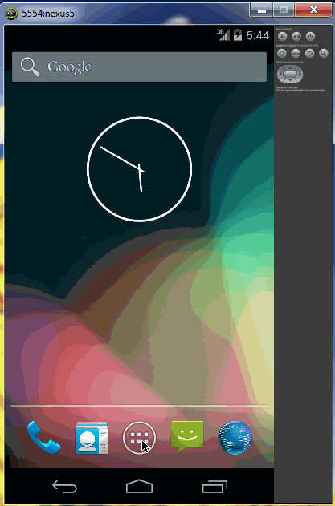

todoapp
=======

A simple Android ToDo App to create list of items and removing them. 
This is an Android demo application for creating list of ToDos. 

Time spent: 4.5 hours spent in total

Completed user stories:

Required: User can Add items to todo list.
Required: User can delete an item by click and hold.
Required: User can edit an item and will be replaced at same position.

Walkthrough of all user stories:

GIF created with LiceCap.
